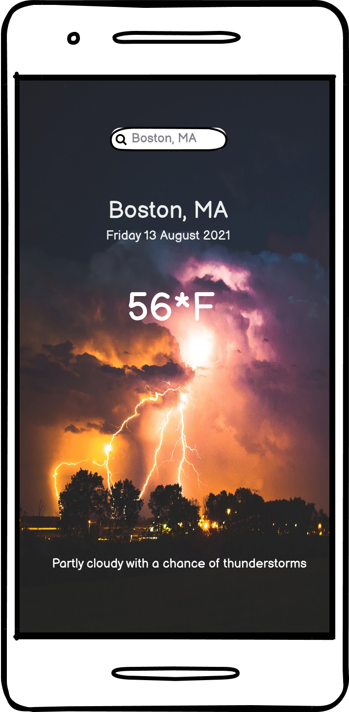
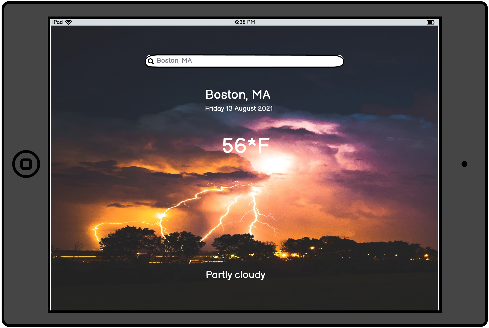
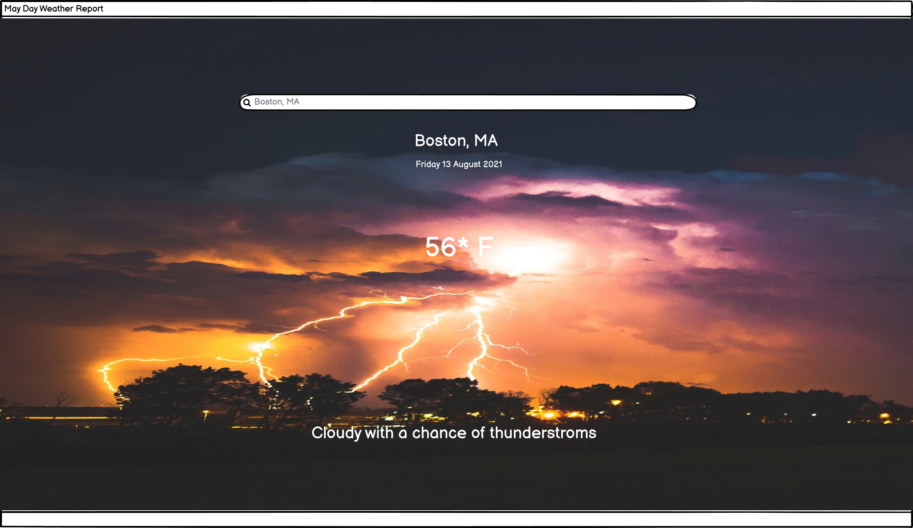

# **May Day Weather Report**

## **Goal for this project** 

Welcome to May Day! Your one stop shop for all your weather needs. On this site, you will easily be able to access the weather
in any location in the world. Plan your day, week, or two with our very user friendly design. Trust that our weather is the most 
accurate so there is no need to look any further than right here.

---

## Table of contents 
* [UX](#ux)
    * [User Goals](#user-goals)
    * [User Stories](#user-stories)
    * [Site Owners Goals](#site-owners-goals)
    * [User Requirements and Expectations](#user-requirements-and-expectations)
        * [Requirements](#requirements)
        * [Expectations](#expectations)
    * [Design Choices](#design-choices)
        * [Fonts](#fonts)
        * [Icons](#icons)
        * [Colors](#colors)
        * [Structure](#structure)
* [Wireframes](#wireframes)
* [Features](#features)
    * [Existing Features](#existing-features)
    * [Features to be implemented](#features-to-be-implemented)
* [Technologies used](#technologies-used)
    * [Languages](#languages)
    * [Tools and Libraries](#tools-and-libraries)
* [Testing](#testing)
* [Deployment](#deployment)
* [Credits](#credits)

## **UX**

### **User Goals**

* A website filled with valuable content
* Website should be easy to use on desktop, tablet & mobile
* Appealing visual elements
* Personal info about property & owners
* Website with creative call-to-actions
* Offer social proof like testimonials & guest reviews
* Contact details should be easy to find
* Form to contact owners directly from site

[Back to Top](#table-of-contents)

### **User Stories**

* As a user, I was to easily input my location information to retrieve the weather data in my desired area.
* As a user, I want to be able to plan my vacation plans around the accurate results from the website.
* As a user, I want to be able to be able to access weather data using my phone's location.
* As a user, I would like to 

### **Site owners Goals**

* As a site owner, I want to provide and UX intuitive website so simple anyone can easily access the weather data.
* As a Site Owner, I want to provide accurate weather reporting so people rely on my service over competition.
* As a Site Owner, I want to make sure the site is visuallly appealing.
* As a Site Owner, I want to give people the option to let the site access their location to give my users 
  automatic weather updates.

[Back to Top](#table-of-contents)

### **User Requirements and Expectations**

#### Requirements
* Easy to navigate by using the navigation menu
* Appealing visual elements
* Easy way to search for different locations for weather data.
* Accurate weather reporting.
* 

#### Expectations
* The search feature should be intuitive and work correctly.
* The Site should have easy links for navigating to other parts of the site.
* Clear info about location 

[Back to Top](#table-of-contents)

### **Design Choices**

#### Fonts
In order to find appropriate fonts for my website, I have visited [Google Fonts](https://fonts.google.com/ "Google Fonts") to explore the various options.

#### Icons

#### Colors
Initially, the original background chosen had a type of May Day style theme behind it with tons of lightning igniting the sky. Getting into the project though, the weather app needed 
a bit of a kick, so the style was completely hanged. A CSS parallax background was added as the motion gives the weather app a nice touch versus being mundane with a simple background image.

#### Structure

[Back to Top](#table-of-contents)

--- 

## **Wireframes**

You can find my wireframes below:

[Back to Top](#table-of-contents)

---

## **Features**

### **Existing Features**

#### Current Location Weather
Upon opening the website page, the weather data for your current location will be displayed along with time and date information.

#### Search Custom Location Weather
The site has a built-in search feature that will allow the users to search anywhere in the world to check the current weather data.

#### Live Weather
The live weather data is displayed conveniently on the landing page. 

#### Forecast Weather
There will be a feature enabling users to check and see what the future weather data will be
for the upcoming week all the way up to ten days.
 

### **Features to be implemented**

* Interactive map for location with a link to activities that are suitable for the days weather.
* A feature that could display the city for which the weather data is being displayed.
* A feature that could change the backgroud image to match the current weather conditions i.e. rainy weather = rainy background.

[Back to Top](#table-of-contents)

## **Technologies used**

### **Languages**

* [HTML](https://en.wikipedia.org/wiki/HTML)
* [CSS](https://en.wikipedia.org/wiki/Cascading_Style_Sheets)
* [JavaScript](https://en.wikipedia.org/wiki/JavaScript)

### **Libraries & Frameworks**

* [Font Awesome](https://fontawesome.com/)
* [Bootstrap](https://getbootstrap.com/)
* [Google Fonts](https://fonts.google.com/)

### **Tools**
* [Git](https://git-scm.com/)
* [GitPod](https://www.gitpod.io/)
* [Balsamic](https://balsamiq.com/wireframes/)
* [W3C HTML Validation Service](https://validator.w3.org/)
* [W3C CSS Validation Service](https://jigsaw.w3.org/css-validator/)
* [techsini](http://techsini.com/)
* [Tiny PNG](https://tinypng.com/)

[Back to Top](#table-of-contents)

## **Testing**
Testing can be viewed at [TESTING.md](https://github.com/susanmarie87/may-day-weather-report/TESTING.md)

### Navigation bar

* **Plan**    

* **Implementation**   
. 

* **Test**    

* **Result**    

* **Verdict**    

* **Implementation**    

* **Test**    

* **Result**    

* **Verdict**    

### Contact Form 

* **Plan**    

* **Implementation**    

* **Test**    

* **Result**    

* **Verdict**    

[Back to Top](#table-of-contents)

### Bugs

#### Form validation

* **Bug**    

* **Fix**        

* **Verdict**    

#### Hero Image

* **Bug**    

* **Fix**    

* **Bug**    

* **Fix**    

* **Verdict**    

#### Navigation menu on smaller screensizes 

* **Bug**    

* **Fix**        

* **Verdict**    

[Back to Top](#table-of-contents)

## **Deployment**

This project was deployed via GitHub by executing the following steps.
After writing the code, committing and pushing it to GitHub:

1. Navigate to the repository on github and click **Settings**.
1. From there, go to the **Source section** within the Github Pages section.
1. Select **master branch** on the dropdown menu, and click save.
1. Now the website is live on **https://anouksmet.github.io/Naturazy/**
1. Any time commits and pushes are sent to Github, the Github Pages site should update shortly after.

To run the project locally:

1. Click the **green Clone or Download button** on the Github Repository
1. Using the **Clone with HTTPS option**, copy the link displayed.
1. Open your IDE, and ensure the Git Terminal is open.
1. Change the working directory to the location where the cloned directory is to go.
1. Use the **"git clone" command** and paste the url copied in the second step.

[Back to Top](#table-of-contents)

## **Credits**

### Content - Media - Inspiration

[CSS Parallax Background Effect.](https://www.sliderrevolution.com/resources/css-animated-background/)

[Inspiration for the project](https://www.youtube.com/watch?v=n4dtwWgRueI)

### Acknowledgements

[Back to Top](#table-of-contents)

