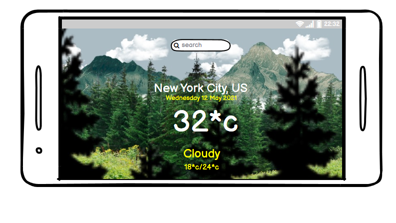

# **May Day Weather Report**

## **Goal for this project** 

Welcome to May Day! Your one stop shop for all your weather needs. On this site, you will easily be able to access the weather
in any location in the world. Plan your day, week, or two with our very user friendly design. Trust that our weather is the most 
accurate so there is no need to look any further than right here.

---

## Table of contents 
* [UX](#ux)
    * [User Goals](#user-goals)
    * [User Stories](#user-stories)
    * [Site Owners Goals](#site-owners-goals)
    * [User Requirements and Expectations](#user-requirements-and-expectations)
        * [Requirements](#requirements)
        * [Expectations](#expectations)
    * [Design Choices](#design-choices)
        * [Fonts](#fonts)
        * [Icons](#icons)
        * [Colors](#colors)
        * [Structure](#structure)
* [Wireframes](#wireframes)
* [Features](#features)
    * [Existing Features](#existing-features)
    * [Features to be implemented](#features-to-be-implemented)
* [Technologies used](#technologies-used)
    * [Languages](#languages)
    * [Tools and Libraries](#tools-and-libraries)
* [Testing](#testing)
* [Deployment](#deployment)
* [Credits](#credits)

## **UX**

### **User Goals**

* A website filled with valuable content
* Website should be easy to use on desktop, tablet & mobile
* Appealing visual elements
* Accurate weather information.
* The location selection should encompass all feasible locations.
* The weather data is correct and shows the proper weather information.

[Back to Top](#table-of-contents)

### **User Stories**

* As a user, I was to easily input my location information to retrieve the weather data in my desired area.
* As a user, I want to be able to plan my day around the accurate results from the website.
* As a user, I want to be able to be able to access weather data using my phone's location.
* As a user, I would like to see the high temperature or low temperature.
* As a user, I want to be able to easily see the results of the weather. I do not want to have to follow multpile links to find the answer.
* As a user, I do not want to have to strain my eyes to see the weather data being displayed.
* As a user, I want a simple app that will not drain my phone of its battery.
* As a user, I want to be able to choose celsius or farenheit when reviewing the weather information.

### **Site owners Goals**

* As a site owner, I want to provide and UX intuitive website so simple anyone can easily access the weather data.
* As a Site Owner, I want to provide accurate weather reporting so people rely on my service over competition.
* As a Site Owner, I want to make sure the site is visuallly appealing.
* As a Site Owner, I want to give people the option to let the site access their location to give my users 
  automatic weather updates.

[Back to Top](#table-of-contents)

### **User Requirements and Expectations**

#### Requirements
* The application should allow users to operate the resources intuitively.
* The web application's resources should be easily identifiable and easy to use.
* The application must return accurate weather data.
* The web application should return accurate weather reporting of high and low temperatures.
* The web application should return accurate reporting of conditions outside i.e. clouds, rain, sun.

#### Expectations

* The user should know exactly what to do when first introduced to the landing page.
* The search feature should be intuitive and work correctly.
* There should be clear info about location and data. 
* The option to choose between farenheit or celsius should be functional.
* The buttons for the choices should stand out prominently and easily catch the eye.
* The description of the weather outside should be accurate.
* The minimum and maximum tempratures need to be mostly accurate give or take few degrees.

[Back to Top](#table-of-contents)

### **Design Choices**

#### Fonts
In order to find appropriate fonts for my website, I have visited [Google Fonts](https://fonts.google.com/ "Google Fonts") to explore the various options.

#### Colors

#ffff80 - The primary color used for this project is a medium type yellow that stands outs against the naturesque background. It also blended nicely and was not overpowering. This color looks to be the perfect fic against the parallax background.

The background image represents the color scheme consisting mainly of green, a light gray, brown mountains and black giving which shows forest imagery. 

The color chosen for the font was: #ffff80 which is a soft yellow to stand out against the parallax background. The font color needs to be specific against this images as it will pass through many different shades. #ffff80 seemed to be the best fit as it was the least straining on the eyes. 

#### Structure

[Back to Top](#table-of-contents)

--- 

## **Wireframes**

You can find my wireframes below:

[Back to Top](#table-of-contents)

---

## **Features**

### **Existing Features**

#### Current Location Weather
Upon opening the website page, the weather data for your current location will be displayed along with time and date information.

#### Search Custom Location Weather
The site has a built-in search feature that will allow the users to search anywhere in the world to check the current weather data.

#### Live Weather
The live weather data is displayed conveniently on the landing page. 

 

### **Features to be implemented**
* Forecast weather
* Interactive map for location with a link to activities that are suitable for the days weather.
* A feature that could display the city for which the weather data is being displayed.
* A feature that could change the backgroud image to match the current weather conditions i.e. rainy weather = rainy background.
* Data on the safety of road conditions. 

[Back to Top](#table-of-contents)

## **Technologies used**

### **Languages**

* [HTML](https://en.wikipedia.org/wiki/HTML)
* [CSS](https://en.wikipedia.org/wiki/Cascading_Style_Sheets)
* [JavaScript](https://en.wikipedia.org/wiki/JavaScript)

### **Libraries & Frameworks**

* [Font Awesome](https://fontawesome.com/)
* [Bootstrap](https://getbootstrap.com/)
* [Google Fonts](https://fonts.google.com/)

### **Tools**
* [Git](https://git-scm.com/)
* [GitPod](https://www.gitpod.io/)
* [Balsamic](https://balsamiq.com/wireframes/)
* [W3C HTML Validation Service](https://validator.w3.org/)
* [W3C CSS Validation Service](https://jigsaw.w3.org/css-validator/)
* [techsini](http://techsini.com/)
* [Tiny PNG](https://tinypng.com/)

[Back to Top](#table-of-contents)

## **Testing**
Testing can be viewed at [TESTING.md](https://github.com/susanmarie87/may-day-weather-report/TESTING.md)

* **Plan**    
Initially, the original background chosen had a type of May Day style theme behind it with tons of lightning igniting the sky. However, this picture and background theme was changed in the middle of the project. It was too harsh visually and the weather app called for something that would be slightly more impressive, which led me to find the CSS parallax background.

* **Implementation**   
. The CSS parallax background image was adapted from (https://www.sliderrevolution.com/resources/css-animated-background/) and implemented into the style.css file. 

* **Test**    
The background was tested on multiple screen sizes and devices all of which presented properly and did not return any errors. There was however an issue with visual appeal.
Due to the many colors in the background, it seemed as though all of the font colors would strain the eyes. 

* **Result**    
The visual problem was solved by removing the green trees in the background. This offset the clouds just enough so that the font did not get lost when it moved through the white backgroud. The green also impaired the font color presentation.
* **Verdict**    
The background looked much better without the green trees behind the font but was still visually appealing to the user.

* **Plan**   
The weather app needs to have a search box function where a user can input the location information and the app will return the exact data of the desired location. 

* **Implementation**    
Several methods were used in order to get this function to work properly. First, the header and input type for the search box was set in index.html. Next, the search box was styled in CSS. Finally, the JavaScript const searchbox function was added into the scripts.js file.
* **Test**    
The searchbox function returns locations. 
* **Result**    
 The search box function returned the locations but it was not giving an error alert if the spelling was incorrect or if the location was unknown. 
* **Verdict**    
While the searchbox returned the weather location information properly, it did not have an error function which is necessary in the event of grammatical errors or unknown location.
* **Plan**    
The weather app will have a feature that returns the high and low temperatures of the location. 
* **Implementation**    
This was accomplished by 
* **Test**    

* **Result**    

* **Verdict**    

[Back to Top](#table-of-contents)

### Bugs
The first bug that took years off of my life and made me doubt my entire existence, was merely a dash that should have been and equal sign. This minor error was detrimental to my time and was discovered with the help of my mentor, Sime DAehlin. 

The second bug that was discovered were simple misspelling in the const functions. The first two were missing the TEXT portion of inner.Text. The last error of the consts were 

[Back to Top](#table-of-contents)

## **Deployment**

This project was deployed via GitHub by executing the following steps.
After writing the code, committing and pushing it to GitHub:

1. Navigate to the repository on github and click **Settings**.
1. From there, go to the **Source section** within the Github Pages section.
1. Select **master branch** on the dropdown menu, and click save.
1. Now the website is live on **https://susanmarie87.github.io/May-Day-Weather_Report/**
1. Any time commits and pushes are sent to Github, the Github Pages site should update shortly after.

To run the project locally:

1. Click the **green Clone or Download button** on the Github Repository
1. Using the **Clone with HTTPS option**, copy the link displayed.
1. Open your IDE, and ensure the Git Terminal is open.
1. Change the working directory to the location where the cloned directory is to go.
1. Use the **"git clone" command** and paste the url copied in the second step.

[Back to Top](#table-of-contents)

## **Credits**

### Content - Media - Inspiration

[CSS Parallax Background Effect.](https://www.sliderrevolution.com/resources/css-animated-background/)

[Inspiration for the project](https://www.youtube.com/watch?v=n4dtwWgRueI)

### Acknowledgements
[Simen Daehlin](https://www.linkedin.com/in/simendaehlin/) for quite literally dragging me through JavaScript. 
Without his help in helping to change my mindset about my capabilities, I may have given up. 

[Code Institute](https://codeinstitute.net/) for all of their assistance, patience with me, and resources to help me along

[Back to Top](#table-of-contents)

