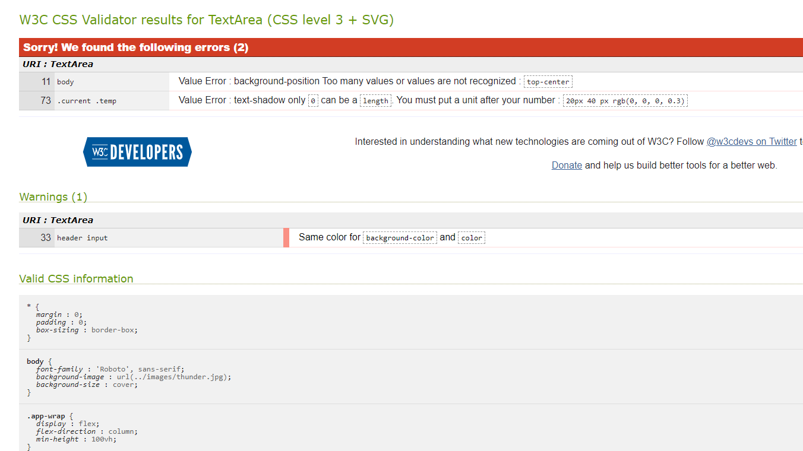
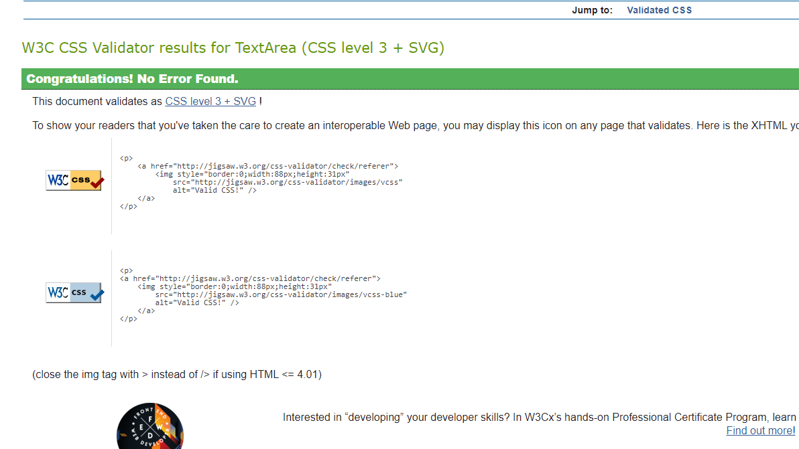

# Testing

---

## Table of Contents:

- [Code Validation](#code-validation)
  - [W3C HTML Validator](#w3c-html-validator)
  - [W3C CSS Jigsaw Validator](#w3c-css-jigsaw-validator)
  - [JSHint](#jshint)
- [Performance](#performance)
  - [PageSpeed Insights](#pagespeed-insights)
  - [Google Lighthouse](https://github.com/kenwilde1/crate-o-wine/blob/main/TESTING.md#google-lighthouse)
- [User Testing](#user-testing)
  - [Browser Compatibility](#browser-compatibility)
  - [Responsiveness Testing](#responsiveness-testing)
  - [User Stories Testing](#user-stories-testing)
  - [User Inputs Testing](#user-inputs)
- [Bugs](#bugs)

## Code Validation

### W3C HTML Validator

All html written for the site was checked using the HTML Validator on [W3C](https://validator.w3.org/).

* **HTML Result:**

### W3C CSS Jigsaw Validator

The CSS was checked and upon the first passm two minor errors were returned. One error was from unnecessary code. Another error in the text-shadow values which was removed as the text-shadow did not add much to the site itself.

The CSS was then ran through again and passed all tests. 

### JSHint

[Back to top](#table-of-contents)

---

## Performance

### PageSpeed Insights

### Google Lighthouse

[Back to top](#table-of-contents)

---

## User Testing

### Browser Compatibility

**Note**: Responsiveness covers Desktop, Mobile and Tablet.

[Back to top](#table-of-contents)

### Responsiveness Testing

The following breakpoints were tested using Chrome Dev Tools:

- **Desktop** - 1920px x 1080px
- **Tablet** - 768px x 1024px
- **Mobile** - 360px x 640px

| 

### User Stories Testing

[Back to top](#table-of-contents)

### User Inputs

[Back to top](#table-of-contents)

### Bugs

Click here to go back to [README](https://github.com/susanmarie87/may-day-weather-report/README.md)

